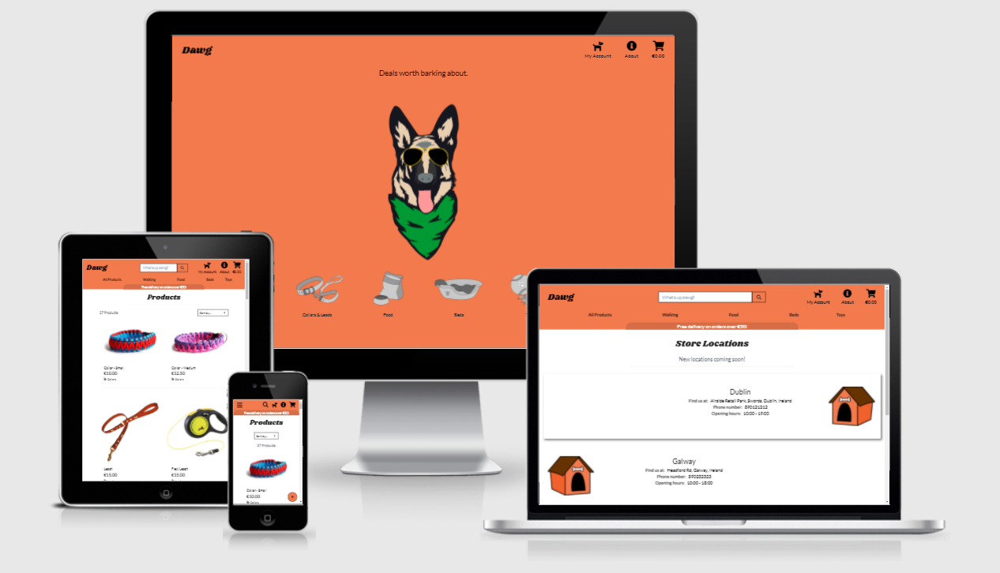

# Dawg
<i>The cool new dog supplies store</i>

Dawg is a full-stack application that contains CRUD functinality and built in stripe functionality to purchase products.

[View the live project by clicking here](http://shanekeran-dawg.herokuapp.com/)



<span id="top"></span>

## Table of Contents
>1. [User Experience](#ux)
>2. [Database](#database)
>3. [Technology](#tech)
>4. [Testing](#testing)
>5. [Deployment](#deployment)
>6. [Credits](#credits)

<span id="ux"></span>
## User Experience (UX)
___
### **Overview**

I used user stories and the five planes of user experience design as a framework for planning, creating and refactoring the project.

### **User Stories**

*As a site user, I want to*

- Clearly understand the purpose of the site upon entering for the first time.
- Easily navigate the site so that I can find the pages and products I want quickly and with ease.
- Have the ability to sort products alphabetically and by price.
- View the current total of shopping bag at any time and have the option to update or delete items.
- Be able to create an account to save shipping information and view previous orders.
- Contact dawg incase I have any questions or concerns.
- Easily recover my password in the likely event that I forget it.
- Receive a confirmation email when I have placed an order.

*As a site owner, I want to*

- Give site admins a straightforward process for adding or updating products on the site.
- Easily add new store location information as the company expands throughout Ireland.
- Store contact form submissions.
- Only display the pages that are currently accessible to the user navigating the site.


### **Strategy**


### **Scope**

Features to be included on the website are:
- On mobile the category links on the bottom row will collapse into a burger menu. The links to the Account, About pages, Search bar and Shopping bag will remain as icons on the right hand side (No text).
- Clicking on any product image will open up a product detail page containing more information on the selected product.
- On screen sizes with a width of 577px+, Directly below the shopping cart icon will have the current total price of items added.
- Orders equal or greater than €30 won't have a delivery charge applied. When an item is added to the shopping bag, the user will be told how much more they need to spend to qualify for free delivery.
- CRUD functionality. Superusers can access the the Product management page to add products. They can also edit/delete products from the product page. Superusers can also use the Django admin panel to view customer submissions from the contact form and add new store locations to the locations page.
- Message success/alert/error/warning toasts to give user feedback based on actions taken e.g. product successfully added to shopping bag or order confirmed.

Features to be introduced at a later date:
- Add the Google Maps API to the Locations page to pinpoint each store's exact location.
- Add a testimonials and FAQ (returns / shipping information) app in addition to my current two custom models.

### **Structure**

Dawg is a multi-page website, with certain pages only accessible to users that are logged in and features only available to super users.

1. Home

    The Home section contains a large logo and images for each product category. It's clerly evident what the site content is. Since these images are present, the home page has a more simplified navigation menu compared to the other pages, it excludes the product menu and free delivery banner. All images on the page are clickable links which take you to their corresponding product category. The main Dawg image links to the "All Products" page which contains products of all category types. The images have also been applied with hover effects from hover.css to make the home page more fun and interactive.

2. Products

    The products are all listed in a structured bootstrap card layout. There is a dropdown menu on the right to sort products by price, name or categories. Product categories are also listed on the lower navigation menu. If user clicks on a particular product, they will be taken to the product detail page containing the full information and an option to add to the shopping bag.

3. Bag

    The bag app gives the user the ability to view and update product quantities. It displays the unit price of each product, the delivery fee and the grand total cost of the order. If the order is below €30, a message will display letting the user know how much more they need to spend to avail of free delivery.

4. Checkout

    Users can fill out delivery and credit card details to make an order. Users with an account have the option to save the delivery information to their profile to make future orders easier. Users not currently logged in will be requested to login or create an account to save this information. A confirmation email is sent to the user after a payment is confirmed and an order is created.

5. Profile (Logged In users only)

    The profile page allows users to add/update their contact and delivery information. It also displays their Order History, which links to each individual order confirmation page giving full details for each past order placed with Dawg.

6. Locations

    The locations page lists the various dawg stores throughout Ireland. It provides basic details such as phone number, address and opening hours.


7. Contact Us

    The Contact Us page offers the user the option to reach out directly to Dawg. On submission of the form, a message is displayed to the user that their message was received.
    


### **Skeleton**

I used Balsamiq to create a wireframe for each device.

[Wireframe - Home page](./readme_images/wireframes/home.png)

[Wireframe - Product](./readme_images/wireframes/product.png)

[Wireframe - Contact](./readme_images/wireframes/contact.png)

[Wireframe - Location](./readme_images/wireframes/locations.png)

### **Surface**

#### Colour

My main colour theme is a mix of #F37A4D, #00000 and #FFFFFF. I chose #F37A4D as it's a very vibrant colour which stands out from the background and demands the attention of the user. Dawg was designed to be a breath of fresh air amongst pet store brands, so it's important that the colour theme is aligned to its purpose.


#### Typography

I chose the Shrikhand font for my logo text because of its "groovy" and alternative feel, which I feel matches the tone of the site.

<a href="#top">Back to top.</a>
<span id="database"></span>

## Database
___
During local development, I used Django's default SQLite3 database. The deployed site on Heroku uses a PostgreSQL database.

### **Database schema**


<span id="tech"></span>

## Technologies Used
___

### **Languages**

- HTML5
- CSS3
- JavaScript
- Python

### **Frameworks, Libraries & Programs used**

1. Git

    Used for Version control.

2. GitHub

    Project files were pushed from Git to GitHub.

3. Gitpod

    I used Gitpod's dev environment to write the code for my project.

4. Bootstrap v4.4.1

    Bootsrap was heavily used throught the site to speed up development time. Most notably on the navigation bar, buttons, grid layout on each page, card components for the products page and various alignment / styling classes applied to elements on each page to minimise custom css needed.

5. Google Fonts

    Google Fonts was used to access the Shrikhand font.

6. Font Awesome

    Font Awesome was used to display various icons throughout the site.

7. Adobe Creative Suite

    This was used to create the home page dawg image, category images and the kennel images for the locations page.

8. Balsamiq

    Balsamiq was used to create the wireframes.

9. Am I Responsive?

    Used to create the image at the beginning of this readme, with the website displayed on various devices.

10. Heroku

    The live project was deployed to Heroku.

11. AWS

    AWS was used to store the static files for the deployed site.

12. Hover.css

    Hover.css classes were used to apply custom hover effects on the home page.

13. Coolors

    Used to generate the colour palette image included in this README.

<a href="#top">Back to top.</a>
<span id="testing"></span>

## Testing
___

Please find all testing documentation in my [TESTING.md file](/TESTING.md)

<span id="Deployment"></span>

## Deployment
___

### **How to clone Dawg**

To clone this project from its [GitHub repository](https://github.com/shanekeran/dawg):

1. From the repository, click **Code**
2. In the **Clone >> HTTPS** section, copy the clone URL for the repository
3. In your local IDE open Git Bash
4. Change the current working directory to the location where you want the cloned directory to be made
5. Type `git clone`, and then paste the URL you copied in Step 2

```console
git clone https://github.com/shanekeran/dawg.git
```

6. Press Enter. Your local clone will be created
7. Create a file called env.py to hold your app's environment variables, which should contain the following:

```console
import os

os.environ.setdefault("IP", "0.0.0.0")
os.environ.setdefault("PORT", "5000")
os.environ.setdefault("SECRET_KEY", "<app secret key></app>")
os.environ.setdefault("MONGO_URI", "mongodb+srv://<username>:<password>@<cluster_name>-ofgqg.mongodb.net/<database_name>retryWrites=true&w=majority")
os.environ.setdefault("MONGO_DBNAME", "<database name>")
os.environ.setdefault("EMAIL_ADDRESS", "<sender email address>")
os.environ.setdefault("PASSWORD", "<email address password></email>")
```
8. env.py must be listed in your .gitignore file to prevent your environment variables being pushed publicly
9. The app can now be run locally using

```console
python3 app.py
```

### **Heroku**

How I deployed the application on Heroku:

1. I navigated to [Heroku](https://www.heroku.com/)
2. Signed into my existing Heroku account. 
3. Selected "New" on the dashboard and then "Create new application" option as below:
4. Selected a name for my application, selected "Europe" as the region and clicked "Create app".
5. With the "Deploy" tab selected, "GitHub - Connect to GitHub" was chosen as the deployment method.
6. Making sure my GitHub profile was displayed, I clicked "connect" next to the GitHub repository for this project.
7. Then I navigated to the "Settings" tab and clicked on "Reveal Convig Vars".
8. Added in my configuration variables to Heroku.
9. Navigated back to the "Deploy" tab and selected "Enable Automatic Deploys" with the master branch selected from the dropdown box.
10. Then clicked on "Deploy Branch" also with master selected.
11. Site is deployed and any changes are automatically deployed each time they are updated and pushed to GitHub during development.

<a href="#top">Back to top.</a>
<span id="credits"></span>

## Credits
___

### **Code**

- Trixie

    * Trixie granted me permission to use their product images from trixie.de, otherwise I would have had a very empty store to showcase.


- W3Schools

    * [How to flip an image in CSS](https://www.w3schools.com/howto/howto_css_flip_image.asp)

- Hover.css

    * [Hover grow-rotate, skew-forward and float-shadow effects](https://ianlunn.github.io/Hover/)


- Code Institute

    * I heavily relied on the Boutique Ado walkthrough project to build the basics of this application


### Acknowledgements

- Fatima from Tutor support in the Code Institute for helping me transfer my data from my local database to my live database.

- My fellow students on Slack for their inspiration and help.

<a href="#top">Back to top.</a>