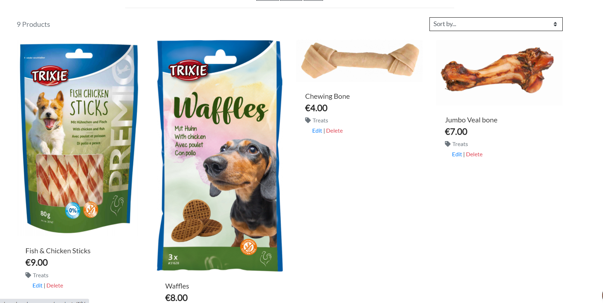

# Dawg: Testing

## Testing the User Stories
___

### Site User

Clearly understand the purpose of the site upon entering for the first time.

When a first time user lands on the home page, they'll see the main dawg logo and images depicting various products (one for each category). With this imagery and the shopping cart icon on the top right, it will be immediately evident that the site sells dog products.

Easily navigate the site so that I can find the pages and products I want quickly and with ease.

- The Home page is designed to allow the user to go directly to the product type they are interested in.
- The navigation menu provides easy access to all pages on the site and a search bar to find a specific item.
- On pages likely to involve some vertical scrolling, a back to top arrow has been placed to easily allow the user to return to the top of the page.

Have the ability to sort products alphabetically and by price.

- A sorting dropdown menu is featured on the product page allowing users to sort by price (low/high), catergory or alphabetically. This will be increasingly important as more products are added to the database.
- The lower navigation menu also gives users the option to go directly to All Products by price or by category, bypassing the need to use the sort dropdown menu.

View the current total of shopping bag at any time and have the option to update or delete items.

- On large screens, the shopping cart icon on the navigation menu will display the current total while the user is browsing anywhere on the site.
- A user on any device can click the shopping cart icon which will take them to their bag which shows the price of each item, delivery fee if applicable and the grand total cost. From this page the user can increase/decrease the quantity of a particular item or remove it from their bag all together.

Be able to create an account to save shipping information and view previous orders.

- Users can click the account logo and select register to create their own profile. On the profile page they cant save their personal information and view their order history.
- If a user proceeds to checkout and they are not logged in, they'll be presented with an option to create an account or to sign in. If the user is signed in, they'll be able to save the inputted information to their profile for future use.

Contact dawg incase I have any questions or concerns.

- Under the About section, there is a link to the Contact Us page where users can submit any questions or concerns to Dawg via the form.

Easily recover my password in the likely event that I forget it.

- There is a link on the login page for any user who has difficulty accessing their account, this link will take them to password reset page where they can input the email address associated to their account.

 

### Site Owner

Give site admins a straightforward process for adding or updating products on the site.

- Superusers can access the django admin panel by navigating to /admin but to make the process easier, I have included a product management page where they can add/edit products from the regular dawg interface.
- Super users can edit/delete specific products using the options available to them while on the product page. An edit and delete link has been put below each product card.

Easily add new store location information as the company expands throughout Ireland.

- I created a custom locations model within the locations app which allows superusers to add new stores to the locations page when they open. When the required details have been entered in the django admin panel, the new store will automatically appear on the locations page.

Store contact form submissions.

- Users can submit queries using the form on the Contact Us page. These submissions will automatically save to the database. Superusers can view these queries from the Django admin panel, where they will be displayed with the most recent queries at the top (Sorted by the date_sent value)

Only display the pages that are currently accessible to the user navigating the site.

When a User is not logged in:
- They can access all pages except the profile, product management or sign out page.

When a User is logged in:

- They can access all pages except the sign up page.
- They can only access the Product management page if they are a superuser.

 

## Issues and Bugs during development
___

### Images not loading after upload to AWS :  Resolved

After setting up AWS S3 for the deployed version of my site, I noticed that 3 or 4 product images were not loading, even though the correct URL was present and the image was uploaded to AWS. After spending some time on it I discovered that after the upload, some images containing two words such as pup-harness, were stripped of their hyphen. The result was the file name containing a space "pup harness.jpg" which was the cause of my issue. I resolved this by renaming the file and adding the hyphen back in.
 

### Bag items displaying on unrelated toast success message :  Resolved
During testing I discovered that when users do certain actions such as submitting the contact form or signing in, the toast success message would also include the bag items. I felt this was unncessary and distracting from the actual success message. To remedy this I added a value of "non_product_page = True" to the context of the home page and within the toast_success file I added some logic to only include the bag items if there is no value for non_product page. Now when users submit the contact form or sign in, when they get redirected to the home page the toast success message only displays the relevant message. When a user adds a product to their bag while browsing the product page, the toast_success message will include the bag items.
 

### Dropdown menu overflowing on small screens :  Resolved
On smaller screens the dropdown menus for the About section were spilling over the edge of the screen. To remedy this I added left: -65px to override the existing left: 0px code being placed on the element. Since the below screenshot was taken I also adjusted the background color back to white and added a thin border.

Click here to display image

 

### Big difference in product image heights :  Resolved
One the first issues I faced, was when I began adding products to my database. After loading all the product images and displaying them on the website, I noticed certain products had a major difference in height. I resolved this by adding a maximum height and width. The product cards with smaller images were then misaligned with those that had larger images so I added flex-grow to the card to prevent this.

Click here to display image

 

### Occasional slow loading of dog kennel images on the locations page :  Unresolved
During testing, I noticed an intermittent issues that occured very infrequently and randomly which was the dog kennel images not loading on the locations page. I imagine this was likely a result of clearing my cache and slow internet speed. Refreshing the page fixed the issue in the moment but I haven't been able to find a clear resolution yet for this problem. The image element contains alt text in case this occurs for the user viewing the page.

Click here to display image

 

### Small section of #F37A4D background colour appearing during page scroll for mobile devices :  Resolved
While conducting responsive testing, I discovered while vertically scrolling on mobile devices, a small portion of #F37A4D background would appear for a couple of seconds at the bottom of page. I imagined this was due to the fact that the white background is applied on the overlay div, with the actual background colour of the whole page underneath being #F37A4D. To remedy this I added a class of bg-white to the body container.

Click here to display image

 

### Minimum and maximum product quantity can be bypassed by manual entry :  Unresolved
When using the plus and minus buttons to increment/decrement product quantities, the buttons will be disabled for values less than 1 or greater than 99. If the user manually inputs a number outside of the minimum/maximum allowed value, while on the product detail page it won't accept the value but if done on the bag page, it will allow it.
 

### {{ MEDIA_URL }} not loading on custom 500 error page :  Unresolved
Although nearly identical to the 404 page, the 500 page was not displaying the main image or favicon. The reason for this is because the {{ MEDIA_URL }} was not being passed into the image src. The final url was only appearing with the file name. To rectify this I added the main image into the AWS static folder and also my local static folder. Then I used  to load the main image instead. This worked but since the favicon was being loaded from the base.html I chose not to change the file path for that at the moment. For now the 500 error page will have the default browser favicon so I'll mark this as unresolved.
 

<a href="#top">Back to top.</a>

## Manual Testing
___

### Home and Home Navigation bar

| Functionality | Expected Outcome | Actual Outcome | Pass/Fail |
| ------------- |:----------------:| :--------------: | ---------: |
| Clicking on image of Dawg | Opens the All Products page | As expected | Pass |
| Clicking on 'Collars & Leads' image | Opens the Collars & Leads category page | As expected | Pass |
| Clicking on 'Food' image | Opens the Food category page | As expected | Pass |
| Clicking on 'Beds' image | Opens the Beds category page | As expected | Pass |
| Clicking on 'Toys' image | Opens the Toys category page | As expected | Pass |
| Clicking on the My Account icon | Opens dropdown menu | As expected | Pass |
| Clicking on the Register link | Opens the signup page | As expected | Pass |
| Clicking on the Login link | Opens signin page | As expected | Pass |
| Clicking on the About icon | Opens dropdown menu | As expected | Pass |
| Clicking on the Locations link | Opens locations page | As expected | Pass |
| Clicking on the Contact Us link | Opens contact page | As expected | Pass |
| Clicking on Shopping cart icon | Opens shopping bag page | As expected | Pass |
| Confirm correct total below Shopping Cart icon | First time users should see €0.00 | As expected | Pass |

### Main Navigation bar (including Product menu)

| Functionality | Expected Outcome | Actual Outcome | Pass/Fail |
| ------------- |:----------------:| :--------------: | ---------: |
| Clicking on Dawg logo | Opens the Home page | As expected | Pass |
| Clicking on Search button with no criteria | Displays toast error | As expected | Pass |
| Searching for "medium" | Displays search results containing medium in title or product description | As expected | Pass |
| Clicking on the My Account icon | Opens dropdown menu | As expected | Pass |
| Clicking on the Register link | Opens the signup page | As expected | Pass |
| Clicking on the Login link | Opens signin page | As expected | Pass |
| Clicking on the About icon | Opens dropdown menu | As expected | Pass |
| Clicking on the Locations link | Opens locations page | As expected | Pass |
| Clicking on the Contact Us link | Opens contact page | As expected | Pass |
| Clicking on Shopping cart icon | Opens shopping bag page | As expected | Pass |
| Clicking on All Products | Opens dropdown menu | As expected | Pass |
| Clicking on the By Price link | Opens the product page sorted by price | As expected | Pass |
| Clicking on the By Category link | Opens the product page sorted by category | As expected | Pass |
| Clicking on the All Products link | Opens the product page listing all products | As expected | Pass |
| Clicking on Walking | Opens dropdown menu | As expected | Pass |
| Clicking on the Collars link | Opens the product page showing only Collars | As expected | Pass |
| Clicking on the Leads link | Opens the product page showing only Leads | As expected | Pass |
| Clicking on the Harnesses link | Opens the product page showing only Harnesses | As expected | Pass |
| Clicking on the All Walking Accessories link | Opens the product page listing all Walking Accessories products | As expected | Pass |
| Clicking on Food | Opens dropdown menu | As expected | Pass |
| Clicking on the Food link | Opens the product page showing only Food | As expected | Pass |
| Clicking on the Treats link | Opens the product page showing only Treats | As expected | Pass |
| Clicking on the Bowls link | Opens the product page showing only Bowls | As expected | Pass |
| Clicking on the All Food Products link | Opens the product page listing all Food products | As expected | Pass |
| Clicking on Beds | Opens dropdown menu | As expected | Pass |
| Clicking on the Indoor link | Opens the product page showing only Indoor beds | As expected | Pass |
| Clicking on the Outdoor link | Opens the product page showing only Outdoor beds | As expected | Pass |
| Clicking on the Blankets link | Opens the product page showing only Blankets | As expected | Pass |
| Clicking on the All Bed Products link | Opens the product page listing all Bed products | As expected | Pass |
| Clicking on Toys | Opens dropdown menu | As expected | Pass |
| Clicking on the Tennis balls link | Opens the product page showing only Tennis balls | As expected | Pass |
| Clicking on the Squeaky link | Opens the product page showing only Squeaky toys | As expected | Pass |
| Clicking on the All Toys link | Opens the product page listing all Toy products | As expected | Pass |
| Resize to mobile screen size | Product menu collapses to Burger menu | As expected | Pass |
| Resize to mobile screen size | Account, About and Grand total text is hidden | As expected | Pass |
| Resize to mobile screen size | Search Bar collapses to just magnifying glass icon | As expected | Pass |
| Click magnifying glass icon on mobile | Opens Search bar | As expected | Pass |
| Click burger icon on mobile | Opens Navigation menu | As expected | Pass |

### Product Page

| Functionality | Expected Outcome | Actual Outcome | Pass/Fail |
| ------------- |:----------------:| :--------------: | ---------: |
| Click on Sort dropdown menu | Expands dropdown menu | As expected | Pass |
| Clicking on the By Price(low to high) | Sorts products beginning with lowest price | As expected | Pass |
| Clicking on the By Price(high to low) | Sorts products beginning with highest price | As expected | Pass |
| Clicking on the By Name(A-Z) link | Sorts products by product name alphabetically | As expected | Pass |
| Clicking on the By Name(Z-A) link | Sorts products by product name in reverse alphabetical order | As expected | Pass |
| Clicking on the By Category(A-Z) link | Sorts products by category alphabetically | As expected | Pass |
| Clicking on the By Category(Z-A) link | Sorts products by category in reverse alphabetical order | As expected | Pass |
| Clicking on any product image | Opens the Product details page for that particular product | As expected | Pass |
| Clicking on the tag below a product | Displays all other products with that product tag | As expected | Pass |
| Clicking on back to top arrow | Jumps back to the top of the page | As expected | Pass |
| Sign in as a superuser | Options to edit / delete appear below each product card | As expected | Pass |
| Click on edit | Opens Product management editor | As expected | Pass |
| Click on delete | Deletes product | As expected | Pass |

### Product Detail Page

| Functionality | Expected Outcome | Actual Outcome | Pass/Fail |
| ------------- |:----------------:| :--------------: | ---------: |
| Click on Keep Shopping button | Opens the product page | As expected | Pass |
| Click on Add to bag button | Toast success message appears confirming action and displays current bag | As expected | Pass |
| Click on Add to bag button | Grand total figure updates underneath shopping cart icon | As expected | Pass |
| Click minus button | Quantity will decrease only if it's greater than 1 | As expected | Pass |
| Click plus button | Quantity will increase only if it's lower than 99 | As expected | Pass |
| Clicking on the product tag | Opens product page filtering for that product tag | As expected | Pass |
| As a superuser, click on edit | Opens Product management editor | As expected | Pass |
| As a superuser, click on delete | Deletes product | As expected | Pass |

### Shopping bag

| Functionality | Expected Outcome | Actual Outcome | Pass/Fail |
| ------------- |:----------------:| :--------------: | ---------: |
| Navigate here after shopping | Products added to the bag should be displayed here | As expected | Pass |
| Click down arrow for Quantity | Quantity will decrease only if it's greater than 1 | As expected | Pass |
| Click up arrow for Quantity | Quantity will increase only if it's lower than 99 | As expected | Pass |
| Increase product quantity from 1 to 2 and select update | Quantity and pricing will update to reflect changes | As expected | Pass |
| Select delete | Product is removed from bag and price is updated to reflect changes | As expected | Pass |
| Add products totaling less than €30 | Delivery charge is applied | As expected | Pass |
| Add products totaling more than €30 | Delivery charge is not applied | As expected | Pass |
| Click on Keep Shopping button | Opens the product page | As expected | Pass |
| Click on Secure Checkout button | Opens the checkout page | As expected | Pass |

### Checkout

| Functionality | Expected Outcome | Actual Outcome | Pass/Fail |
| ------------- |:----------------:| :--------------: | ---------: |
| Navigate here from the Shopping bag | Products from the Shopping bag should be displayed on the right hand side | As expected | Pass |
| Submit checkout form without required fields | Order is not submitted | As expected | Pass |
| Enter incorrect card details | Error message is shown | As expected | Pass |
| Submit order form with correct details and stripe test card | Opens Order confirmation page displaying Order details | As expected | Pass |
| Submit order form with correct details and stripe test card | Sends Order confirmation email to customer | As expected | Pass |
| Submit order form with correct details and stripe test card | Order is created in the Admin panel | As expected | Pass |
| Submit order form with correct details and stripe test card | Payment displays on Stripe dashboard | As expected | Pass |

### Contact Us

| Functionality | Expected Outcome | Actual Outcome | Pass/Fail |
| ------------- |:----------------:| :--------------: | ---------: |
| Try submit form without required fields | Form is not submitted and User is directed to missing form field | As expected | Pass |
| Enter email without incorrect format | Form is not submitted and User is advised of the error | As expected | Pass |
| Submit form with the required information | Redirected to Home and Success message displayed to user | As expected | Pass |

### My Profile

| Functionality | Expected Outcome | Actual Outcome | Pass/Fail |
| ------------- |:----------------:| :--------------: | ---------: |
| Enter delivery information and click update information | Success message displays and information is saved | As expected | Pass |
| Click previous order number | Previous Order confirmation page is displayed | As expected | Pass |
| Manually enter profile page URL while not logged in | Redirected to the sign in page | As expected | Pass |

### Product Management Page

| Functionality | Expected Outcome | Actual Outcome | Pass/Fail |
| ------------- |:----------------:| :--------------: | ---------: |
| Click Category dropdown menu | Ensure all categories are displayed | As expected | Pass |
| Try submit form without required fields | Form is not submitted and User is directed to missing form field | As expected | Pass |
| Try submit form without image selected | Product is created and default image is displayed | As expected | Pass |
| Submit the form with required fields | Product is created | As expected | Pass |
| Click Cancel button | Redirected to Products page | As expected | Pass |

### Account Pages (Login / Register / Logout)

| Functionality | Expected Outcome | Actual Outcome | Pass/Fail |
| ------------- |:----------------:| :--------------: | ---------: |
| Enter incorrect login details | Error message is displayed | As expected | Pass |
| Enter Correct login details | Opens Home page and success message is displayed | As expected | Pass |
| Click sign out button | User is signed out and taken to the Home page. Message is displayed informing of the sign out | As expected | Pass |
| Try submit register form without required fields | Form is not submitted and User is directed to missing form field | As expected | Pass |
| Submit the register form with required fields | User is sent a verification email | As expected | Pass |

### Error Pages

| Functionality | Expected Outcome | Actual Outcome | Pass/Fail |
| ------------- |:----------------:| :--------------: | ---------: |
| Submit the form with required fields | Product is created | As expected | Pass |
| Enter random url | Custom 404 Error page is displayed | As expected | Pass |
| Simulate server error | Custom 500 Error page is displayed | As expected | Pass |
| Click buttons to return to store | Opens Home page | As expected | Pass |

## Validation
___

The W3C Markup Validator, W3C CSS Validator and JSHint were used to validate my code to ensure no syntax errors were overlooked. For my Python code, I used the flake8 command within GitPod to make sure it met PEP8 standards.

Click here to view testing document

 

- HTML Validator

    Overall, the HTML code passed after some minor refactoring. However 1 warning and two errors remain. The errors can be seen here:
    .
    These errors are related to the feature allowing users to add/update the product image from the product management page. As this is dynamically added by Django, I'm unable to access the label or id of id_image to change it so this error will remain. The warning is due to the empty heading elment on the checkout page (h1 class="text-light logo-font loading-spinner"). This contains the loading icon and due to time constraints I have chosen to skip this warning in favour of submitting this project on time.

- CSS Validator

    Base.css passed with 0 errors and 0 warnings.

-  JSHint

    JSHint revealed 0 errors. Initially it showed various missing semicolon warnings, these have now been applied.

- PEP8 / flake8

    Inputting the "python3 -m flake8" command will suggest multiple fixes required for migration files which can be ignored. It also flags the following for settings.py:
    +   ./dawg/settings.py:139:80: E501 line too long (88 > 79 characters)
    +   ./dawg/settings.py:142:80: E501 line too long (81 > 79 characters)
    +   ./dawg/settings.py:145:80: E501 line too long (82 > 79 characters)
    +   ./dawg/settings.py:148:80: E501 line too long (83 > 79 characters)

    These are strings such as 'django.contrib.auth.password_validation.MinimumLengthValidator' and I'll be leaving them as they are based on advice from the code institute slack community [here](https://code-institute-room.slack.com/archives/C7HS3U3AP/p1605890486174200).

    It also suggests removing the following:
    +   ./checkout/apps.py:8:9: F401 'checkout.signals' imported but unused
    +   ./checkout/webhooks.py:28:5: F841 local variable 'e' is assigned to but never used
    +   ./checkout/webhooks.py:31:5: F841 local variable 'e' is assigned to but never used

    I decided to also ignore these suggestions as I believe most likely they are needed but due to time constraints I havent got the time to test the site's functionality without them included.

## Responsive Testing
___

I used [Responsively](https://responsively.app/download/) and the chrome developer tools to test Dawg on a variety of screen sizes and orientations. All tests were successful, with the site retaining its function and design across the different device simulations.

## Browser Testing
___

Google Chrome was used throughout the development process. I tested Dawg on the latest versions of Microsoft Edge, Firefox and Safari(From iPad device only). The site functions well on all the browsers tested.

On Microsft Edge, the #F37A4D background colour appears if you click and drag the page upwards while at the bottom of the page. I demonstrated this within a short loom video [here](https://www.loom.com/share/b55e5a090bbb46f6b5bc102434671386). This only occurs on the Edge browser and is something I'll look into in the future.

## Accessibility testing
___

I used the WAVE Web Accessibility Evaluation Tool to scan the main pages of Dawg. I implemented a lot of changes to improve accessibility such as adding missing form labels, ensuring each page has a h1 element, utilising bootstraps "sr-only" class to add in text for screen readers and using the aria-hidden attribute to hide unnesscary elements such as icons.

## Google Lighthouse
___

Google lighthouse was ran on the main pages of the website. Overall I'm pleased with the results on desktop but the performance is lacking on mobile. The main cause for this is related to images. I plan on compressing the images further to alleviate this in the future to try bring these scores up and have the page speed improved for mobile.

Click here to view lighthouse scores

 

<a href="#top">Back to top.</a>
